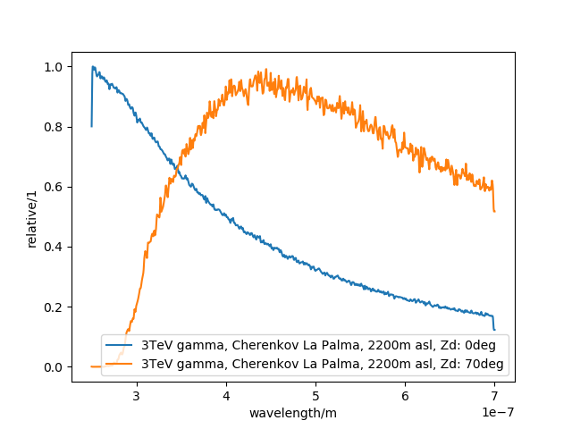
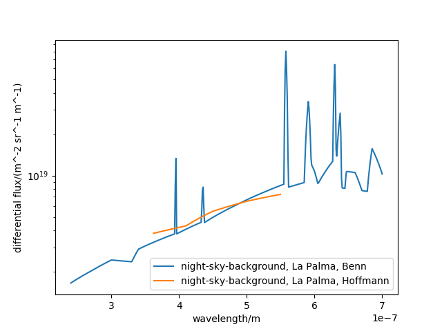
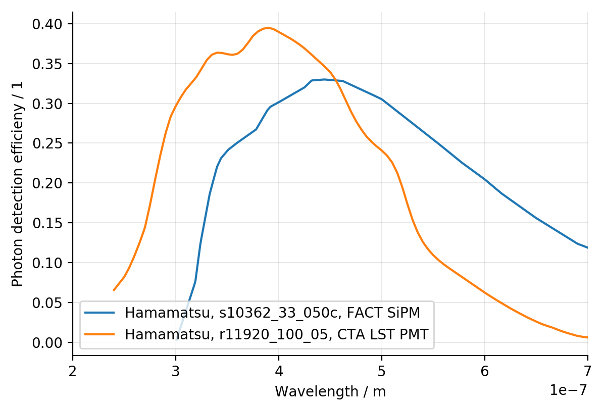

# Photon-spectra
A collection of emission-, transmission- and absorbtion-spectra in atmospheric-Cherenkov-astronomy

We collect examples of photon-spectra of the emission of cherenkov-photons from air-showers.

We collect night-sky-background light fluxes.

We collect the efficiency of sensors to detect photons.

We collect the transmission or reflectivity of optical components.

